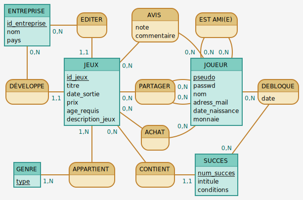
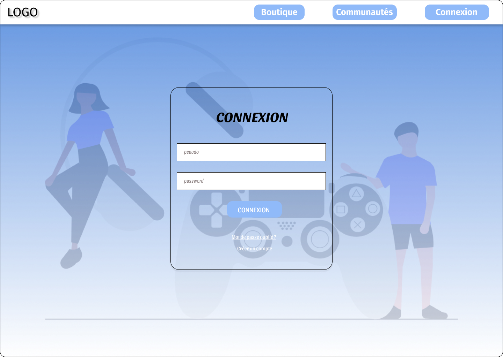
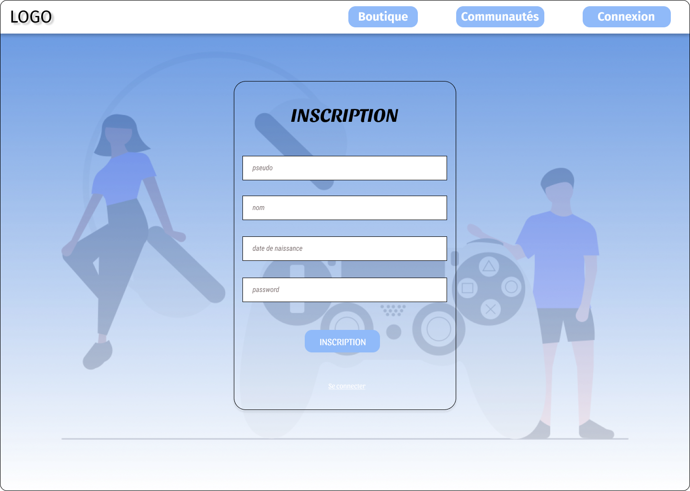
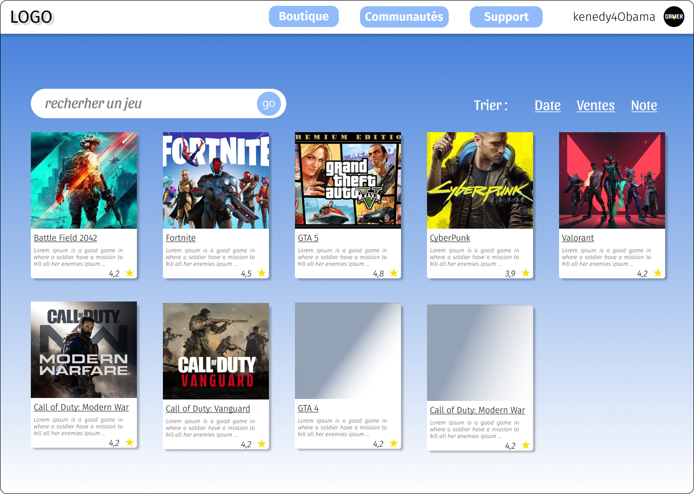
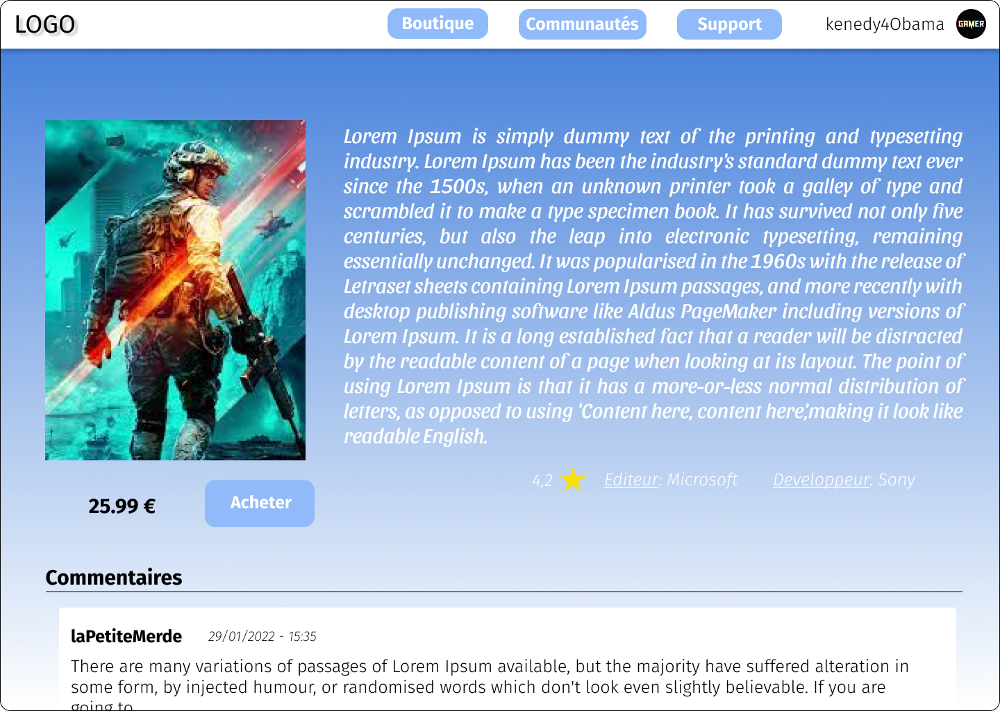

# Project: Cloud

## Presentation

The client wants to build an online video game sales platform. Named ***Cloud***, this platform will allow players to
purchase games, track their progress, and share their opinions and comments on the games they have played with other
players.

## Part 1: Modeling

Model the database as an entity-relationship schema meeting the client's requirements. Below are the different entities,
their attributes, and associations:



Assumption

---

> We had the idea of categorizing achievements by type.

Constraints not guaranteed by the entity-relationship schema:

---

> A player cannot share the same game with multiple friends simultaneously.

Additional information provided directly by the client

---

> It was not specified in the specifications whether a player could leave only one rating (Only comments
> had that specification). Our client confirmed that a player can only leave one rating per
> game.

## Part 2: Implementation

* Translation of the entity-relationship schema into the relational model.

**COMPANY** (<ins>id_company</ins>, name, country)  
**REVIEW** (<ins>_username_</ins>, <ins>_game_id_</ins>, rating, comment)  
**IS FRIEND WITH** (<ins>_username_player_1_</ins>, <ins>_username_player_2_</ins>)  
**GAMES** (<ins>game_id</ins>, title, release_date, price, required_age, game_description, _id_publisher_,
_id_developer_)  
**SHARE** (<ins>_username_player_1_</ins>, <ins>_game_id_</ins>, <ins>_username_player_2_</ins>)  
**PLAYER** (<ins>username</ins>, password, name, email_address, date_of_birth, currency)  
**UNLOCK** (<ins>_achievement_num_</ins>, <ins>_username_</ins>, date)  
**PURCHASE** (<ins>_game_id_</ins>, <ins>_username_</ins>)  
**BELONGS TO** (<ins>_game_id_</ins>, <ins>_type_</ins>)  
**ACHIEVEMENT** (<ins>achievement_num</ins>, title, conditions, _game_id_)

FK: <br>
&emsp;---> **REVIEW**(<ins>_username_</ins>) references **PLAYER**(<ins>username</ins>)

&emsp;---> **REVIEW**(<ins>_game_id_</ins>) references **GAMES**(<ins>game_id</ins>)

&emsp;---> **IS FRIEND WITH**(<ins>_username_player_1_</ins>) references **PLAYER**(<ins>username</ins>)

&emsp;---> **IS FRIEND WITH**(<ins>_username_player_2_</ins>) references **PLAYER**(<ins>username</ins>)

&emsp;---> **GAMES**(<ins>_id_publisher_</ins>) references **COMPANY**(<ins>id_company</ins>)

&emsp;---> **GAMES**(<ins>_id_developer_</ins>) references **COMPANY**(<ins>id_company</ins>)

&emsp;---> **SHARE**(<ins>_username_player_1_</ins>) references **PLAYER**(<ins>username</ins>)

&emsp;---> **SHARE**(<ins>_username_player_2_</ins>) references **PLAYER**(<ins>username</ins>)

&emsp;---> **SHARE**(<ins>_game_id_</ins>) references **GAMES**(<ins>game_id</ins>)

&emsp;---> **UNLOCK**(<ins>_achievement_num_</ins>) references **ACHIEVEMENT**(<ins>achievement_num</ins>)

&emsp;---> **UNLOCK**(<ins>_username_</ins>) references **PLAYER**(<ins>username</ins>)

&emsp;---> **PURCHASE** (<ins>_game_id_</ins>) references **GAMES**(<ins>game_id</ins>)

&emsp;---> **PURCHASE** (<ins>_username_</ins>) references **PLAYER**(<ins>username</ins>)

&emsp;---> **BELONGS TO**(<ins>_game_id_</ins>) references **GAMES**(<ins>game_id</ins>)

&emsp;---> **ACHIEVEMENT**(_game_id_) references **GAMES**(<ins>game_id</ins>)

* Implementation of the relational model in PostgreSQL.

```sql
-- Create necessary tables

-- Company(id_company, name, country)
CREATE TABLE Company
(
    id_company serial primary key,
    name       varchar(255),
    country    varchar(100)
);

-- Games(game_id, title, release_date, price, required_age, game_description, id_publisher, id_developer)
CREATE TABLE Games
(
    game_id          serial primary key,
    title            varchar(255),
    release_date     date,
    price            int,
    required_age     int,
    game_description text,
    id_publisher     int references Company (id_company),
    id_developer     int references Company (id_company)
);
-- Not knowing the average size of a video game description, 
-- we chose the "text" type for the "game_description" field to reserve space dynamically.
-- Moreover, this avoids reserving extra space.

-- Player(username, password, name, email_address, date_of_birth, currency)
CREATE TABLE Player
(
    username      varchar(100) primary key,
    password      varchar(255) not null,
    name          varchar(100),
    email_address varchar(100) not null,
    date_of_birth date         not null,
    currency      int default 0
);

-- Achievement(achievement_num, title, conditions, game_id)
CREATE TABLE Achievement
(
    achievement_num serial primary key,
    title           varchar(255),
    conditions      text,
    game_id         int references Games (game_id)
);

-- Belongs To (game_id, genre_type)
CREATE TABLE BelongsTo
(
    game_id    int references Games (game_id),
    genre_type varchar(100),
    primary key (game_id, genre_type)
);

CREATE TABLE IsFriend
(
    username_player_1 varchar(100) references Player (username),
    username_player_2 varchar(100) references Player (username),
    primary key (username_player_1, username_player_2)
);

-- Purchase(game_id, username)
CREATE TABLE Purchase
(
    game_id  int references Games (game_id),
    username varchar(100) references Player (username),
    primary key (game_id, username)
);

CREATE TABLE Review
(
    username VARCHAR(100) references Player (username),
    game_id  INTEGER references Games (game_id),
    rating   INTEGER,
    comment  VARCHAR(500),
    primary key (username, game_id)
);

-- Share(game_id, username_player_1, username_player_2)
CREATE TABLE Share
(
    game_id           int references Games (game_id),
    username_player_1 varchar(100) references Player (username),
    username_player_2 varchar(100) references Player (username),
    primary key (game_id, username_player_1, username_player_2),
    constraint uniqueShare unique (game_id, username_player_1)
);
-- TODO: Test to be done

-- Unlock(achievement_num, username, unlock_date)
CREATE TABLE Unlock
(
    achievement_num int references Achievement (achievement_num),
    username        varchar(100) references Player (username),
    unlock_date     date
        not null,
    primary key (achievement_num, username)
);
```

## Part 3: Website Mockup

### Login Page



Query

> ```sql
> select password
> from player
> where username='john';
> ```
>
> Verifies that the user's username exists and corresponds to the password.

### Registration Page


Query

> ```sql
> insert into Player(username, password, name, email_address, date_of_birth) 
> values ('john', 'xtvfn$./dfq', 'Doe', 'john@cloud.com', '1990-01-01');
> ```
>
> Creates a new user.

### Store Page



Query (default)

> ```sql
> select title, game_description
> from Games
> order by title;
> ```
>
> Default query for displaying games in the store, sorted alphabetically.

Query (by release date)

> ```sql
> select title, game_description
> from Games
> order by release_date;
> ```
>
> Query for displaying games sorted by release date.

Query (by number of sales)

> ```sql
> select title, game_description
> from Games natural join Purchase
> group by title, game_description
> order by count(*) desc;
> ```
>
> Query for displaying games sorted by number of sales.

Query (by average rating)

> ```sql
> select title, game_description
> from Games natural left join Review
> group by title, game_description
> order by avg(rating) desc;
> ```
>
> Query for displaying games sorted by average ratings.

### Search Page

> Here are some example queries for a search page.

Query (by genre)

> ```sql
> select game_id, title, game_description
> from Games natural join BelongsTo
> where genre_type like '%action%';
> ```
>
> Displays games whose genre starts with the entered text.

Query (by publisher)

> ```sql
> select game_id, title, game_description
> from Games join Company on Games.id_publisher = Company.id_company
> where name like '%microsoft%';
> ```
>
> Displays games whose publisher's name starts with the entered text.

### Detailed Game Page



Query (necessary information)

> ```sql
> select game_id, title, release_date, price, required_age, game_description, publisher.name as publisher, developer.name as developer, avg(rating) as average_rating
> from Games join Company developer on Games.id_developer=developer.id_company join Company publisher on Games.id_publisher=publisher.id_company natural join Review
> where title='title'
> group by game_id, title, release_date, price, required_age, game_description, publisher.name, developer.name;
> ```
>
> Retrieves information about the video game on the page as well as its average rating.

Query (achievements)

> ```sql
> select title, conditions
> from Games natural join Achievement natural left join Unlock
> where title='title' and username='username';
> ```
>
> Displays the achievements of a game if the user has them.

### Personal Profile Page

> Mockup not created

Query (leave a review)

> ```sql
> insert into Review(username, game_id, rating, comment)
> select "username", game_id, 4, "The graphics of the game are very well done. Congratulations to the developers!"
> from Games
> where title='title';
> ```
>
> This query allows the player to leave a review.

Query (update comment)

> ```sql
> update Review
> set comment="This new version has been a disaster in terms of graphics. I am very disappointed."
> where username='username' and game_id=1;
> ```
>
> This query allows the player to update the previously given review.